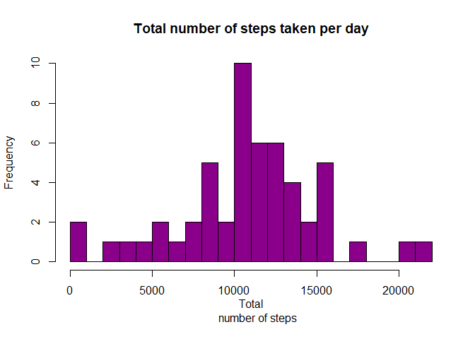
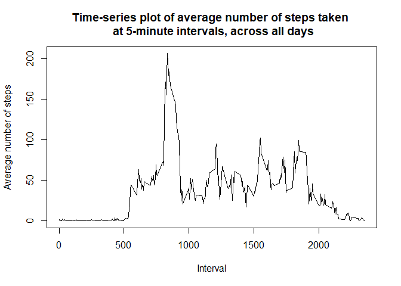
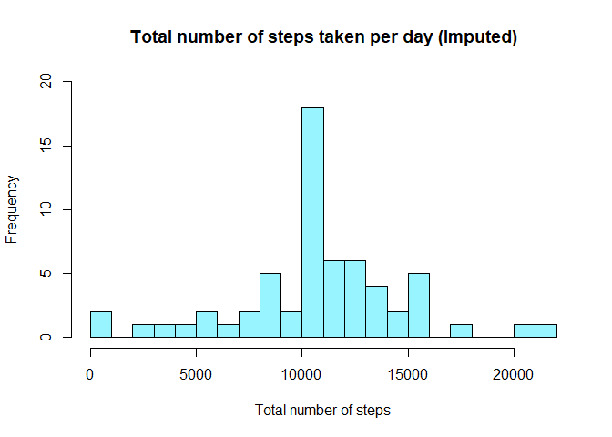
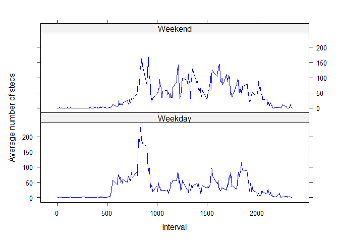

#### This is an R Markdown document for peer assessment 1 of Coursera's Reproducible Research course.

## Loading and preprocessing the data

```r
##Load package
library(dplyr)
library(lattice)
```


```r
##Unzip file and load data
unzip("activity.zip", exdir = "Activity monitoring data")
activitydata <- read.csv("C:/Users/Ailee/Downloads/datasciencecoursera/Course 5/Activity monitoring data/Activity monitoring data/activity.csv")
str(activitydata)
```

```
## 'data.frame':	17568 obs. of  3 variables:
##  $ steps   : int  NA NA NA NA NA NA NA NA NA NA ...
##  $ date    : chr  "2012-10-01" "2012-10-01" "2012-10-01" "2012-10-01" ...
##  $ interval: int  0 5 10 15 20 25 30 35 40 45 ...
```

```r
##Convert date column from character class to Date class
activitydata$date <- as.Date(activitydata$date, format = "%Y-%m-%d")
```
<br/><br/>

## What is mean total number of steps taken per day?
### 1. Calculate the total number of steps taken in a day.

```r
totalsteps <- activitydata %>% 
    group_by(date) %>% 
    summarise(steps = sum(steps))
head(totalsteps)
```

```
## # A tibble: 6 × 2
##   date       steps
##   <date>     <int>
## 1 2012-10-01    NA
## 2 2012-10-02   126
## 3 2012-10-03 11352
## 4 2012-10-04 12116
## 5 2012-10-05 13294
## 6 2012-10-06 15420
```

### 2. Make a histogram of the total number of steps taken each day.

```r
hist(totalsteps$steps, main = "Total number of steps taken per day", xlab = "Total
     number of steps", col = "darkmagenta", breaks = 20)
```

<!-- -->

### 3. Calculate and report the mean and median of the total number of steps taken per day.

```r
mean(totalsteps$steps, na.rm = TRUE)
```

```
## [1] 10766.19
```

```r
median(totalsteps$steps, na.rm = TRUE)
```

```
## [1] 10765
```
<br/><br/>

## What is the average daily activity pattern?
### 1. Make a time series plot (i.e. type = "l") of the 5-minute interval (x-axis) and the average number of steps taken, averaged across all days (y-axis).

```r
##Calculate the average number of steps taken per interval
averagesteps <- activitydata %>% 
    group_by(interval) %>% 
    summarise(steps = mean(steps, na.rm = TRUE))

##Create time-series plot
plot(averagesteps$interval, averagesteps$steps, type = "l", main = "Time-series plot of average number of steps taken \n at 5-minute intervals, across all days", xlab = "Interval", ylab = "Average number of steps")
```

<!-- -->

### 2. Which 5-minute interval, on average across all the days in the dataset, contains the maximum number of steps?

```r
averagesteps[which.max(averagesteps$steps), ]
```

```
## # A tibble: 1 × 2
##   interval steps
##      <int> <dbl>
## 1      835  206.
```
<br/><br/>

## Imputing missing values
### 1. Calculate and report the total number of missing values in the dataset (i.e. the total number of rows with NAs).

```r
sum(is.na(activitydata))
```

```
## [1] 2304
```

### 2. Devise a strategy for filling in all of the missing values in the dataset & 3. Create a new dataset that is equal to the original dataset but with the missing data filled in.

```r
##Replace the missing step values with the mean for that 5-minute interval, then assign it to a new dataset
activitydata2 <- activitydata %>% 
    group_by(interval) %>% 
    mutate(steps = replace(steps, is.na(steps), mean(steps, na.rm = TRUE)))
```

### 4. Make a histogram of the total number of steps taken each day, then calculate and report the mean and median total number of steps taken per day.

```r
##Calculate the total number of steps taken in a day
totalsteps2 <- activitydata2 %>% 
    group_by(date) %>% 
    summarise(steps = sum(steps))

##Create histogram
hist(totalsteps2$steps, main = "Total number of steps taken per day (Imputed)", 
     xlab = "Total number of steps", col = "cadetblue1", ylim = c(0, 20), breaks = 20)
```

<!-- -->

```r
mean(totalsteps2$steps, na.rm = TRUE)
```

```
## [1] 10766.19
```

```r
median(totalsteps2$steps, na.rm = TRUE)
```

```
## [1] 10766.19
```
#### Compared to the first estimate of the total daily number of steps, the mean remains the same but the median differs slightly in the second estimate.  
#### Because the missing values were filled with the mean of the 5-minute interval, this shifted the median value closer to the mean in the second estimate.
<br/><br/>

## Are there differences in activity patterns between weekdays and weekends?
### 1. Create a new factor variable in the dataset with two levels – “weekday” and “weekend” indicating whether a given date is a weekday or weekend day.

```r
##Create new column containing weekdays for each date
activitydata2$week <- weekdays(activitydata2$date)

##Assign values to "Weekend" or "Weekday"
activitydata2[activitydata2$week == "Saturday" | activitydata2$week == "Sunday", 
              ]$week <- "Weekend"
activitydata2[!activitydata2$week == "Weekend", ]$week <- "Weekday" 

##Convert week column from character class to factor class
activitydata2$week <- factor(activitydata2$week)
```
  
### 2. Make a panel plot containing a time series plot (i.e. type = "l") of the 5-minute interval (x-axis) and the average number of steps taken, averaged across all weekday days or weekend days (y-axis).

```r
##Calculate the average number of steps taken per interval for weekends and weekdays, then assign each to a new variable
averagesteps2 <- activitydata2 %>%
    group_by(week, interval) %>% 
    summarise(steps = mean(steps))

##Set up panel plot, then create time-series plots for weekends and weekdays
xyplot(steps ~ interval | week, data = averagesteps2, type = "l", col = "blue", 
       xlab = "Interval", ylab = "Average number of steps", layout = c(1, 2))
```

<!-- -->
